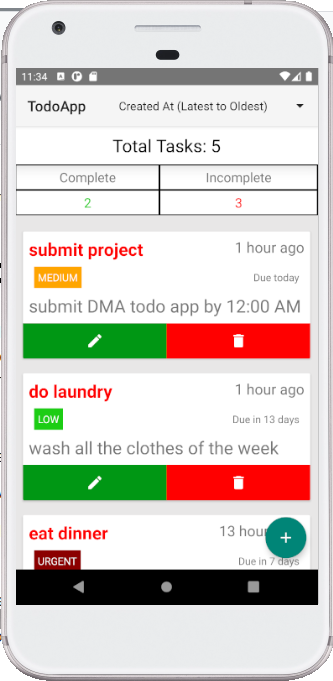
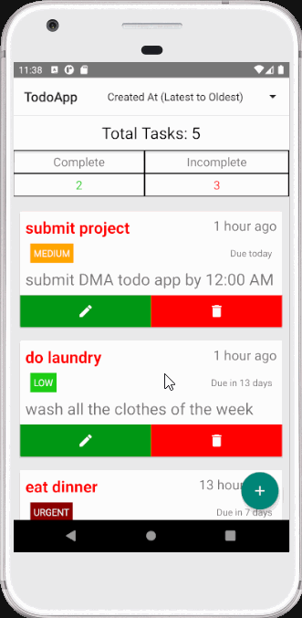
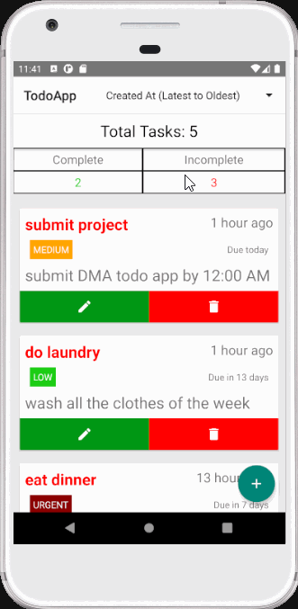
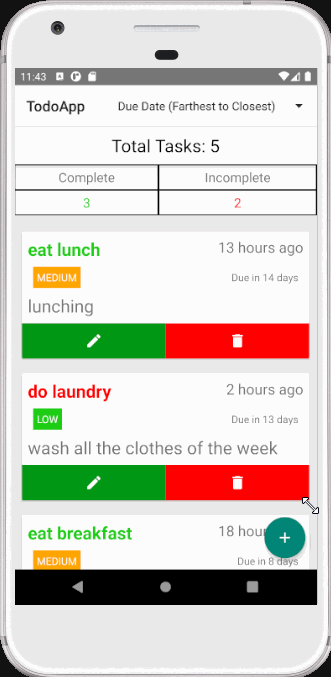
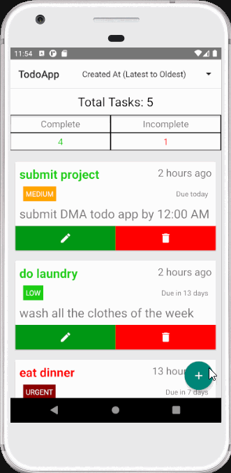
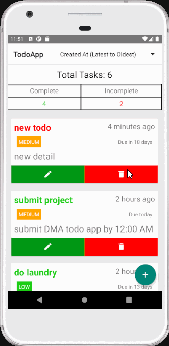

# Todo App



This is a Todo app built using the MVVM (Model-View-ViewModel) architectural pattern. The app allows users to manage their tasks and keep track of their todo items for daily use.

## Features

- Create, update, and delete todo items
- Mark todo items as complete/incomplete
- View all details about the todo
- Data is persisted in the Room database
- MVMM architecture is followed for the app
- Observer pattern is followed for todos and sorting

## Additional Features

- Todos can be sorted by created date, due date, or alphabetically
- Get a summary of completed, incomplete and total todos in home page
- Swipe left or right to go to the previous or next todo detail
- Todos can be given a priority and category
- Color coded todos based on status
- Loading screen
- Confirmation dialog before deleting a todo
- Toasts for CRUD notifications

## Screenshots

### Todo list



This is the landing activity of the todo app. A summary of the complete, incomplete and total todos are shown at the top. And the list of todos are displayed in a recycler view. Each todo is 
displayed as a card with the title, due date, priority, created date. The status is indicated with the color of the title. There are 2 action buttons used to edit or delete a todo. There is also a 
floating action button used to add a new todo. A sort spinner is located at the menu which is used to sort the todos.

### Sort Todos



The sorting feature allows users to sort the todos by created date, due date or alphabetically. The sorting is done using the Room database and LiveData.

### Todo Detail Activity



On clicking the title of a todo, the user is taken to the detail activity. The detail activity shows all the details of the todo. The user can change the status of the todo with a button. 
The background color indicated whether the todo is complete or incomplete. Users can also swipe left or right to go to the previous or next todo detail.

### Add Todo task



The add todo activity allows users to add a new todo. The user can enter the title, detail, due date, priority and category of the todo. The user can select the due date from a date picker. The default status will be incomplete.

### Edit todo task


The edit todo activity allows users to edit an existing todo. The user can edit the title, detail, due date, priority and category of the todo. The user can select the due date from a date picker. A switch can be used to toggle the status.

### Delete todo task



User can delete todos by clicking the delete action button. A confirm dialog box will appear and choosing yes will delete the todo.


## Getting Started

### Prerequisites

- Android Studio (version 2022.2.1)
- Android SDK v33
- Java Development Kit (JDK) v1.8
- Pixel XL Emulator

### Installation

1. Clone the repository:

```git clone https://github.com/Yathaartha/Todo-App.git```


2. Open the project in Android Studio.

3. Build and run the app on an emulator or physical device.

## Architecture

The app follows the MVVM (Model-View-ViewModel) architectural pattern. Here's a brief overview of each component:

- Model: Represents the data and business logic of the app. It includes data models, repositories, and any other classes related to data management.

- View: Responsible for rendering the UI and handling user interactions. It includes activities, fragments, and XML layout files.

- ViewModel: Acts as a mediator between the View and the Model. It exposes data to the View and handles user actions. It's responsible for retrieving and updating data from the Model.

## Libraries Used

- LiveData: Lifecycle-aware data holder class provided by the Android Architecture Components. Used for observing data changes in the ViewModel and updating the UI.

- Room: Provides an abstraction layer over SQLite to handle database operations. Used for storing and retrieving todo items.
